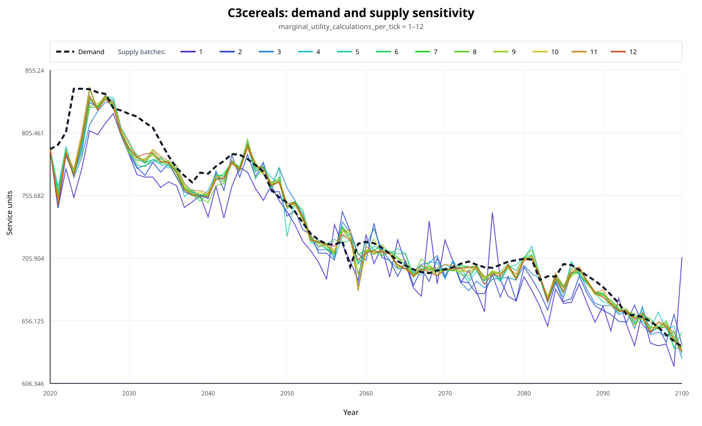
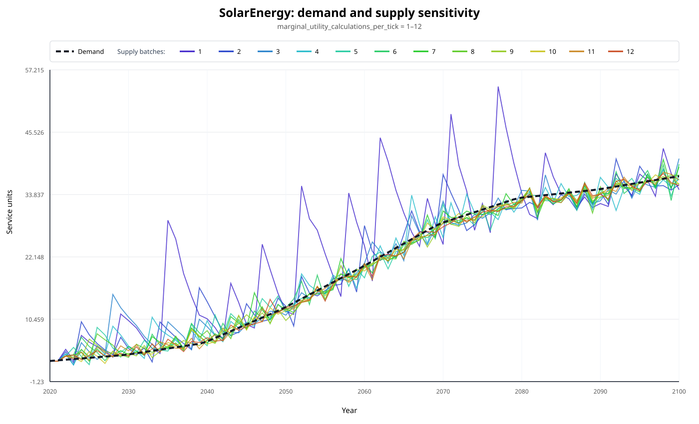
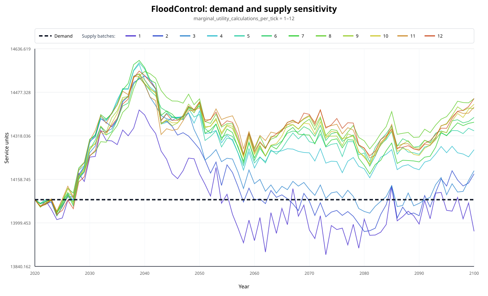
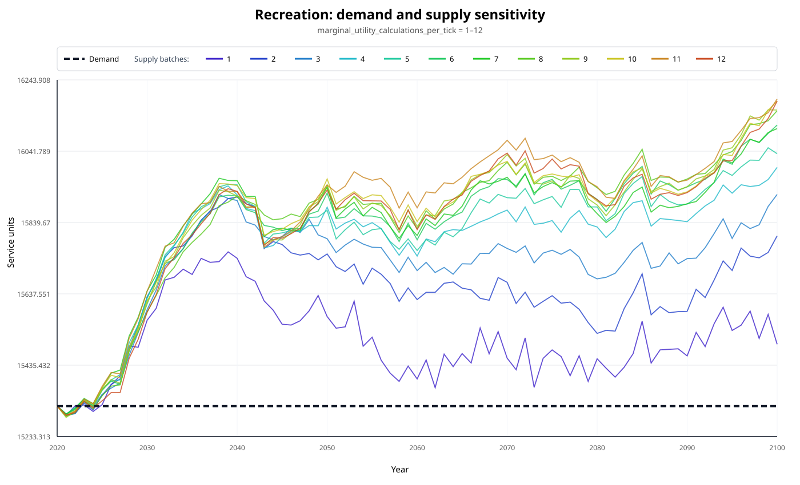

# `marginal_utility_calculations_per_tick` sensitivities

## Purpose

`marginal_utility_calculations_per_tick` controls how frequently service supply and marginal utility are
reassessed during land competition within a simulation year. A larger value allows later allocation decisions
to respond to supply changes made earlier in the same year. The expected effect is a smoother adjustment of
service supply to changing demand.

This sensitivity analysis tests values from 1 to 12 for the SSP126 scenario. All other model settings and input
data are held constant. The comparison covers all 20 services in the aggregate model output.

## Reading the figures

Each figure contains:

- one dashed demand line, because demand is identical in every experiment;
- twelve supply lines, one for each tested parameter value;

Two complementary indicators are used:

- **supply roughness**, which measures year-to-year oscillation in the supply trajectory;
- **supply-demand RMSE**, which measures the typical absolute distance between supply and demand.

Lower values of both indicators are preferable for services where both undersupply and oversupply are penalized.
For services that allow oversupply, a one-sided **demand-shortfall** indicator is used in place of symmetric RMSE.

## Overall result

Increasing the parameter from 1 to 12 reduced supply roughness for **all 20 services**. The median reduction was
50.3%, and the mean reduction was 44.6%. This provides consistent evidence that more frequent marginal-utility
recalculation produces smoother supply trajectories.

The size of the response varied substantially between services:

| Service | Roughness reduction, 1 → 12 | Smoothest tested value |
|---|---:|---:|
| SolarEnergy | 79.6% | 10 |
| C3oilcrops | 66.8% | 11 |
| C4crops | 63.0% | 12 |
| Ldiversity | 57.3% | 11 |
| C3pulses | 56.4% | 9 |
| Hardwood | 6.5% | 3 |
| Pasture | 10.3% | 6 |

The result is therefore robust in direction but not uniform in magnitude. The smoothest service-specific values
range from 3 to 12, so the largest value is not automatically best for every service.

## Selected services

### C3 cereals

C3-cereal supply became substantially smoother as recalculation frequency increased. Between values 1 and 12,
roughness fell by 51.5% and supply-demand RMSE fell by 46.0%. For this service, value 7 produced both the
smoothest trajectory and the lowest RMSE among the tested values.

### Solar energy

Solar energy showed the strongest response in the analysis. Roughness fell by 79.6% and supply-demand RMSE by
87.2%. Value 10 produced the best result for both indicators.

### Flood control

Flood-control supply became 52.1% smoother. Symmetric supply-demand RMSE increased because **this service does not
penalize oversupply**; once demand is met, additional supply is not assigned negative marginal utility. The
one-sided shortfall indicator gives the more relevant result: shortfall RMSE fell by 87.9%, and the number of
years below demand fell from 47 to 7.

### Recreation

Recreation supply became 49.2% smoother, but it was the only **non-oversupply-penalized** service whose shortfall
metric did not improve at value 12. Shortfall RMSE increased by 5.3%, while years below demand increased from two
to three. The absolute shortfall remained rare, but the result demonstrates that smoother supply does not always
mean closer demand satisfaction.

## Oversupply and demand shortfall

All 13 services that penalize oversupply had lower supply-demand RMSE at value 12 than at value 1. Their median
RMSE reduction was 32.5%, and their mean reduction was 43.4%.

Symmetric RMSE can be misleading for services that do not penalize oversupply. For these services, demand
shortfall and the number of years below demand provide a better interpretation:

| Service | Shortfall RMSE change, 1 → 12 | Years below demand, 1 → 12 |
|---|---:|---:|
| FloodControl | −87.9% | 47 → 7 |
| SoilRetention | −44.2% | 80 → 80 |
| Pollination_disp | −50.7% | 52 → 21 |
| Biodiversity | −20.1% | 1 → 2 |
| Ldiversity | −53.0% | 71 → 76 |
| Carbon | −10.9% | 69 → 44 |
| Recreation | +5.3% | 2 → 3 |

Six of these seven services had a smaller typical shortfall at value 12. Shortfall magnitude and frequency should
both be considered: a trajectory can contain more years with small shortfalls while still having a lower typical
shortfall magnitude.

## Scope of the conclusion

These results describe one SSP126 experiment with a fixed random seed. They establish a clear within run effect,
but they do not yet quantify stochastic or scenario uncertainty. A broader assessment should repeat selected
values across multiple seeds and scenarios and report ensemble medians and uncertainty intervals.
