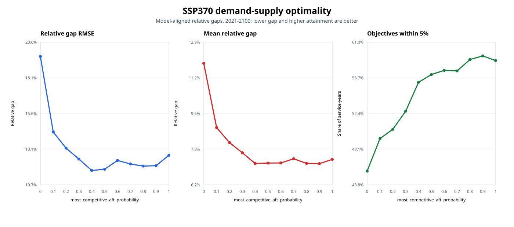
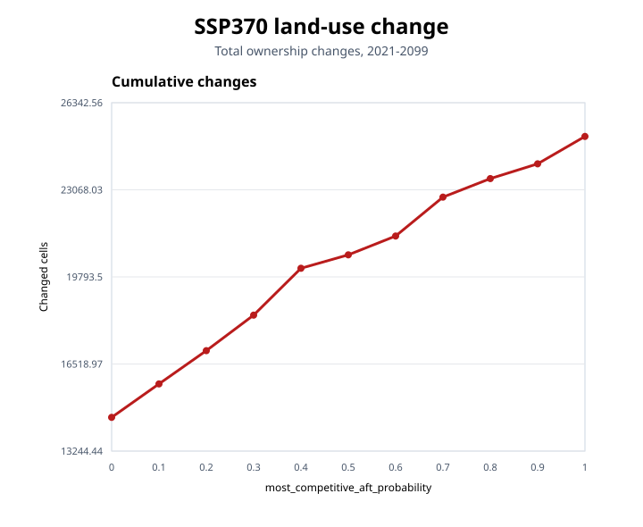
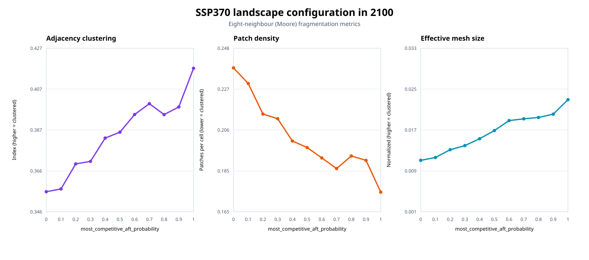
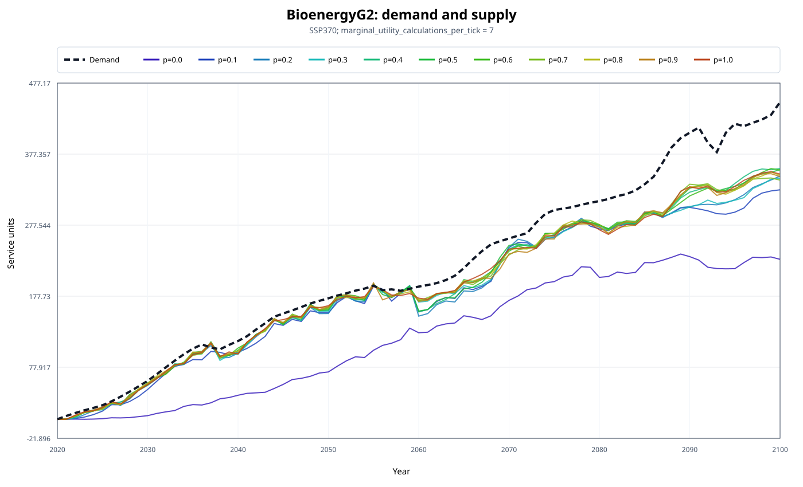
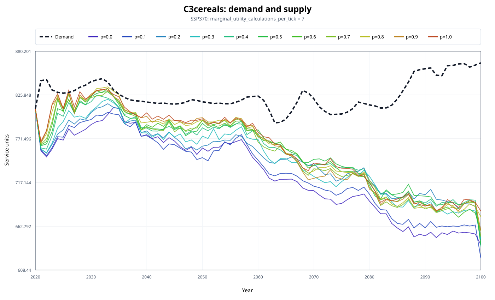
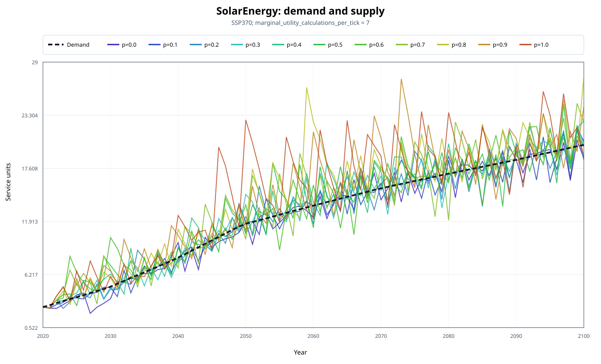

# `most_competitive_aft_probability` sensitivities

## Purpose

`most_competitive_aft_probability` controls how often land competition selects the candidate AFT with the
highest utility. At `0.0`, candidate selection is random; at `1.0`, the highest-utility candidate is always
selected. Intermediate values retain some exploration while increasingly favouring the locally best candidate.

This sensitivity analysis tests values from `0.0` to `1.0` in increments of `0.1` under SSP370. The experiment
holds all other settings constant, including:

- `random_seed: 1`;
- the SSP370 demand trajectories;
- the participating-cell fraction and neighbourhood settings.

The comparison covers 20 services and the period 2021-2100. The calibrated year 2020 is excluded from the
demand-supply performance summary.

## Measuring demand-supply performance

The performance measure follows the objective used for each service:

- when oversupply is penalized, the relative gap is `abs(supply - demand) / abs(demand)`;
- when oversupply is not penalized, only shortfall is counted:
  `max(demand - supply, 0) / abs(demand)`.

The summary gives every service and year equal weight. Lower mean gap and RMSE indicate closer demand matching.
The attainment rate is the share of service-years with a model-aligned relative gap no greater than 5%.

## Overall result

Increasing the probability substantially improves demand matching between `0.0` and approximately `0.4`.
Beyond `0.4`, the mean gap remains close to 7.2% and the response becomes non-monotonic. Always choosing the
highest-utility candidate is therefore not the best setting for every performance indicator.

- `0.4` has the lowest overall relative-gap RMSE: 11.66%, a 40.5% reduction from `0.0`.
- `0.9` has the lowest mean relative gap: 7.15%, and the highest 5%-attainment rate: 59.38%.
- The mean gap at `0.4` is only 0.06% higher than at `0.9`, while producing 16.3% fewer land-use changes.
- At `1.0`, both mean gap and RMSE increase relative to their best tested values.

These results identify `0.4` as the strongest compromise when typical error, demand matching, and land-use
turnover are considered together. A value near `0.9` is preferable only when maximizing the number of
service-years close to their objective is the main priority.

| Probability | Mean gap | Gap RMSE | Within 5% | Land-use changes | Clustering index, 2100 | Patch density, 2100 | Effective mesh, 2100 |
|---:|---:|---:|---:|---:|---:|---:|---:|
| 0.0 | 11.87% | 19.58% | 45.44% | 14,512 | 0.3558 | 0.2378 | 0.0111 |
| 0.1 | 8.85% | 14.33% | 49.38% | 15,770 | 0.3572 | 0.2299 | 0.0116 |
| 0.2 | 8.15% | 13.21% | 50.50% | 17,020 | 0.3697 | 0.2143 | 0.0131 |
| 0.3 | 7.67% | 12.45% | 52.69% | 18,356 | 0.3709 | 0.2119 | 0.0139 |
| 0.4 | 7.16% | 11.66% | 56.19% | 20,118 | 0.3825 | 0.2006 | 0.0153 |
| 0.5 | 7.18% | 11.74% | 57.12% | 20,623 | 0.3855 | 0.1973 | 0.0169 |
| 0.6 | 7.19% | 12.35% | 57.63% | 21,330 | 0.3943 | 0.1920 | 0.0188 |
| 0.7 | 7.38% | 12.11% | 57.56% | 22,793 | 0.3997 | 0.1866 | 0.0191 |
| 0.8 | 7.17% | 11.96% | 58.94% | 23,490 | 0.3942 | 0.1930 | 0.0194 |
| 0.9 | 7.15% | 11.99% | 59.38% | 24,045 | 0.3980 | 0.1907 | 0.0200 |
| 1.0 | 7.35% | 12.71% | 58.81% | 25,075 | 0.4173 | 0.1746 | 0.0229 |

Land-use changes are summed over 2021-2099 because the standard land-event output ends in 2099. Demand-supply
and fragmentation outputs include 2100.

## Land-use change

Land-use change increases at every tested step, from 14,512 changes at `0.0` to 25,075 at `1.0`, an increase of
72.8%. Higher probabilities close much of the demand-supply gap by directing more cells toward higher-utility
AFTs, but they also generate more ownership turnover.

## Landscape fragmentation

The 2100 metrics use the eight-neighbour Moore definition, under which
cells sharing an edge or corner are connected. Between `0.0` and `1.0`:

- the adjacency clustering index increases by 17.3%, from 0.3558 to 0.4173;
- patch density decreases by 26.6%, from 0.2378 to 0.1746;
- normalized effective mesh size increases by 106.5%, from 0.0111 to 0.0229;
- same-AFT adjacency increases by 16.4%;
- Shannon diversity decreases by 8.0%, indicating that increased spatial aggregation is accompanied by a less
  even AFT composition.

The three connectivity indicators consistently show larger, more connected same AFT patches at high
probabilities. The result supports a more clustered landscape, although maps would still be needed to identify
where individual clusters occur.

## Selected services

Each service figure shows the fixed demand trajectory and an exact line-colour key for all eleven probability
values.

### Bioenergy generation 2

BioenergyG2 shows the largest improvement among services that penalize oversupply. Its mean relative gap falls
from 50.68% at `0.0` to 11.61% at `1.0`, a reduction of 77.1%. The number of evaluated years within 5% of demand
increases from zero to ten.

### C3 cereals

C3 cereals shows a more typical response. Its mean relative gap falls from 11.84% at `0.0` to 7.82% at `1.0`,
while the number of years within 5% of demand increases from seven to forty.

### Solar energy

The aggregate improvement is not universal. Solar-energy demand matching is best at `0.1`, with a mean relative
gap of 7.16%. The gap then increases to 23.52% at `1.0`. This service-level trade-off explains why the overall
error stops improving once the probability reaches approximately `0.4`.

## Interpretation

The results partially support these hypothesis:

- favouring the most competitive AFT improves overall demand-supply matching, but benefits level off near `0.4`;
- higher probabilities produce more spatially clustered AFT patterns;
- improved demand matching is achieved with more land-use changes;
- full determinism at `1.0` is not the overall demand-supply optimum.

The analysis uses one SSP370 run per value with a fixed random seed. It isolates the parameter effect for this
configuration but does not quantify uncertainty across seeds.