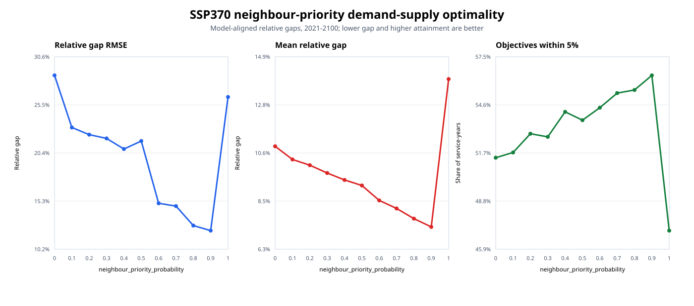
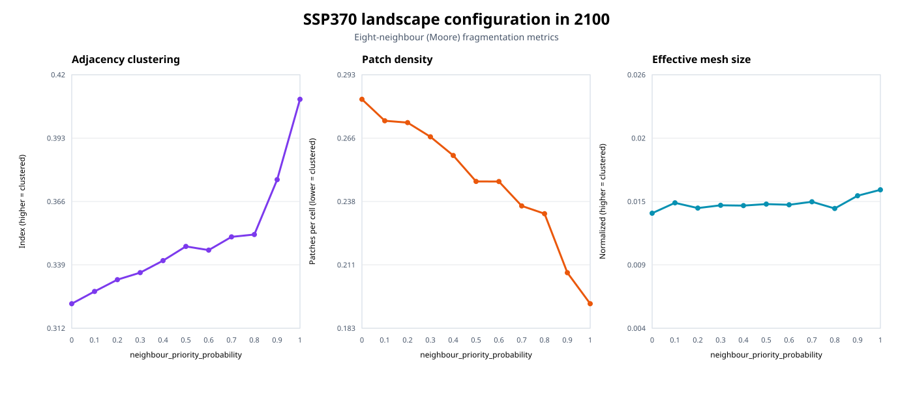
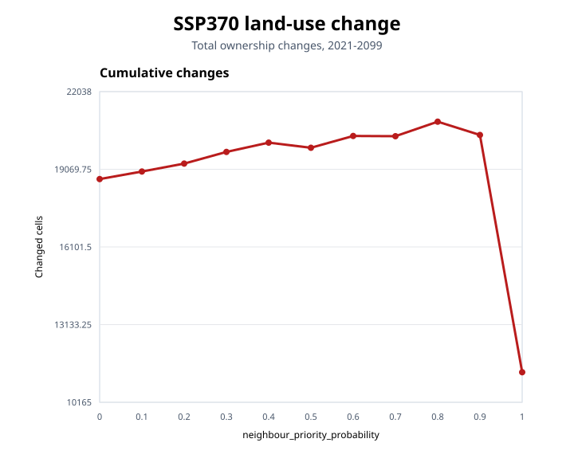
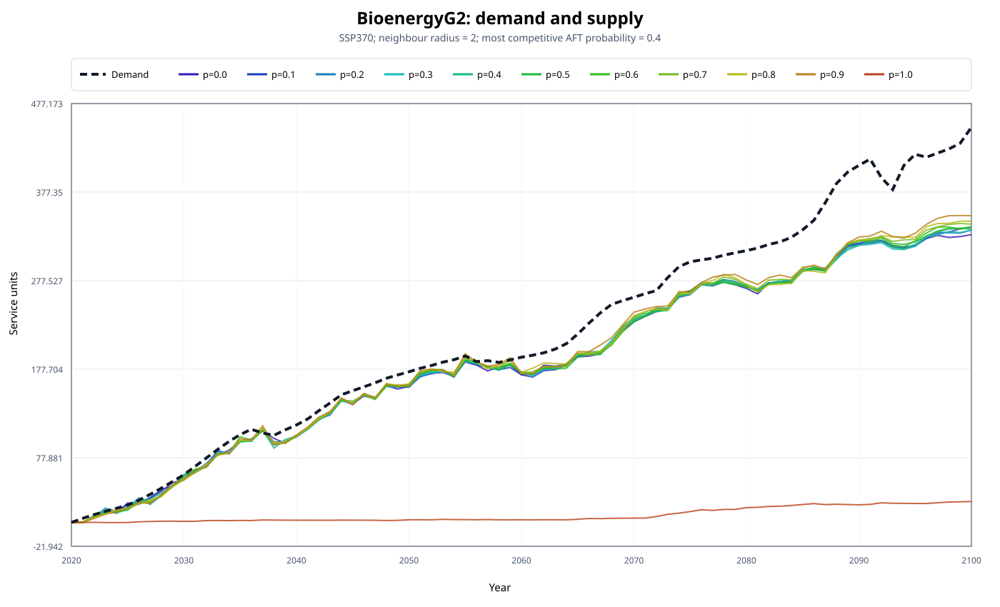
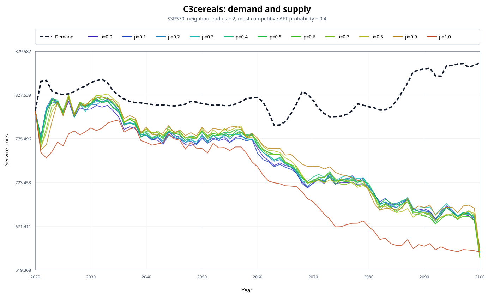
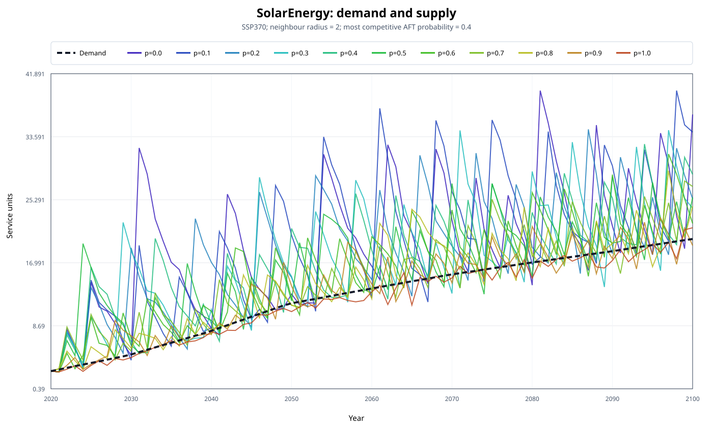

# `neighbour_priority_probability` sensitivities

## Purpose

`neighbour_priority_probability` controls how often land competition restricts candidate AFTs to those already
present in the surrounding neighbourhood. A value of `0.0` never applies neighbour priority and is therefore
equivalent to disabling `use_neighbour_priority`. A value of `1.0` always uses the local candidate set.

This sensitivity analysis tests values from `0.0` to `1.0` in increments of `0.1` under SSP370. The
neighbourhood radius is fixed at two cells so the probability effect can be evaluated independently. Other
settings are held constant:

- `use_neighbour_priority: true`;
- `neighbour_radius: 2`;
- `marginal_utility_calculations_per_tick: 7`;
- `most_competitive_aft_probability: 0.4`;
- `random_seed: 1`.

The comparison covers 20 services and the period 2021-2100. The calibrated year 2020 is excluded from the
demand-supply performance summary.

## Measuring performance

Demand-supply convergence uses the same model-aligned relative gap as the other sensitivity analyses:

- for services that penalize oversupply: `abs(supply - demand) / abs(demand)`;
- for services that allow oversupply: `max(demand - supply, 0) / abs(demand)`.

Lower mean gap and RMSE indicate better convergence. The attainment rate is the share of service-years with a
model-aligned gap no greater than 5%. Landscape structure is measured with eight-neighbour Moore fragmentation
metrics.

## Overall result

Neighbour priority improves demand-supply convergence when its probability increases from `0.0` to `0.9`:

- the mean relative gap falls from 10.92% to 7.31%, a reduction of 33.1%;
- relative-gap RMSE falls from 28.59% to 12.18%, a reduction of 57.4%;
- the 5%-attainment rate increases from 51.44% to 56.38%, a gain of 4.94 percentage points.

The response changes sharply at `1.0`. Mean gap rises to 13.93%, RMSE rises to 26.31%, and attainment falls to
47.06%. A probability of `1.0` removes all remaining global candidate exploration: every competition event is
restricted to AFTs already present within radius 2. This can preserve locally available land-use patterns even
when other AFTs would better address regional service gaps.

For the fixed radius of two cells, `0.9` is the best tested value for all three aggregate convergence indicators.

| Probability | Mean gap | Gap RMSE | Within 5% | Land-use changes | Clustering index, 2100 | Patch density, 2100 | Effective mesh, 2100 |
|---:|---:|---:|---:|---:|---:|---:|---:|
| 0.0 | 10.92% | 28.59% | 51.44% | 18,696 | 0.3222 | 0.2826 | 0.0139 |
| 0.1 | 10.33% | 23.08% | 51.75% | 18,984 | 0.3274 | 0.2733 | 0.0148 |
| 0.2 | 10.07% | 22.32% | 52.88% | 19,287 | 0.3324 | 0.2725 | 0.0143 |
| 0.3 | 9.72% | 21.93% | 52.69% | 19,733 | 0.3354 | 0.2663 | 0.0146 |
| 0.4 | 9.41% | 20.81% | 54.19% | 20,088 | 0.3405 | 0.2582 | 0.0145 |
| 0.5 | 9.16% | 21.65% | 53.69% | 19,892 | 0.3466 | 0.2470 | 0.0147 |
| 0.6 | 8.49% | 15.07% | 54.44% | 20,343 | 0.3450 | 0.2469 | 0.0146 |
| 0.7 | 8.13% | 14.77% | 55.31% | 20,334 | 0.3506 | 0.2364 | 0.0149 |
| 0.8 | 7.68% | 12.71% | 55.50% | 20,889 | 0.3516 | 0.2330 | 0.0143 |
| 0.9 | 7.31% | 12.18% | 56.38% | 20,381 | 0.3750 | 0.2075 | 0.0154 |
| 1.0 | 13.93% | 26.31% | 47.06% | 11,314 | 0.4092 | 0.1940 | 0.0159 |

Land-use changes are summed over 2021-2099 because the standard land-event output ends in 2099. Demand-supply
and fragmentation outputs include 2100.

## Landscape fragmentation

Neighbour priority has a strong and largely monotonic aggregation effect. Between probabilities `0.0` and
`1.0` in 2100:

- the adjacency clustering index increases by 27.0%, from 0.3222 to 0.4092;
- patch density decreases by 31.3%, from 0.2826 to 0.1940;
- normalized effective mesh size increases by 14.7%, from 0.0139 to 0.0159;
- same-AFT adjacency increases from 0.4072 to 0.4889.

The fully local `1.0` case is the most clustered, even though it has the poorest aggregate demand-supply
attainment. Spatial aggregation and service convergence are therefore related but distinct objectives.

## Land-use turnover

Land-use changes increase moderately from 18,696 at `0.0` to 20,381 at `0.9`. At `1.0`, however, changes fall
to 11,314, 44.5% below the `0.9` result. This is consistent with local lock-in: a fully restricted candidate set
reduces the alternatives available to replace the current owner.

## Selected services

Each figure shows the fixed demand trajectory and an exact line-colour key for all eleven neighbour-priority
probabilities.

### Bioenergy generation 2

BioenergyG2 demonstrates the discontinuity at full neighbour priority. Its mean relative gap is 12.45% at `0.0`
and 11.78% at `0.9`, but rises to 92.11% at `1.0`. None of the evaluated years is within 5% of demand in the
fully local case.

### C3 cereals

C3-cereal mean gap falls from 9.25% at `0.0` to 8.41% at `0.9`, while years within 5% of demand increase from
27 to 37. At `1.0`, the mean gap rises to 12.45% and only seven years remain within 5%.

### Solar energy

Solar energy responds differently. Its mean relative gap falls continuously from 72.77% at `0.0` to 15.50% at
`0.9` and 5.81% at `1.0`. Full neighbour priority benefits this service even though it worsens the aggregate
result, illustrating why service-level trajectories should be reviewed alongside the overall score.

## Interpretation

The experiment supports three conclusions:

- increasing neighbour priority up to `0.9` improves overall service convergence;
- stronger neighbour priority creates larger and more connected same-AFT patches;
- removing global candidate exploration entirely at `1.0` produces excessive local lock-in.

The analysis uses one SSP370 run per value with a fixed random seed. Repeating the most informative values across
seeds would be required to quantify stochastic uncertainty.
