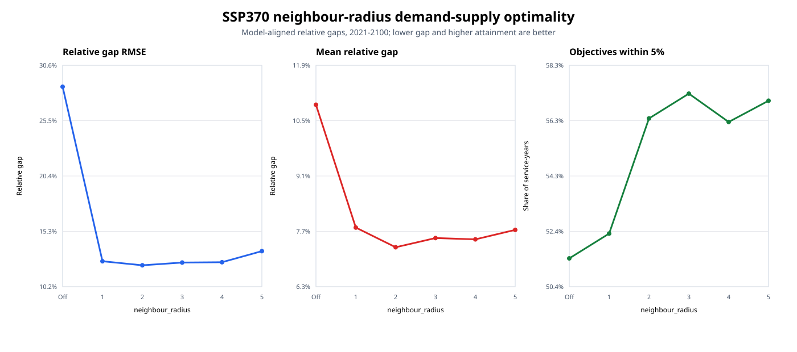
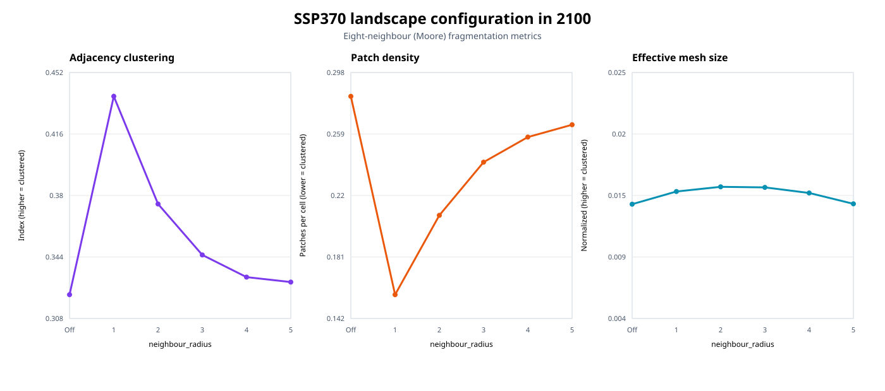
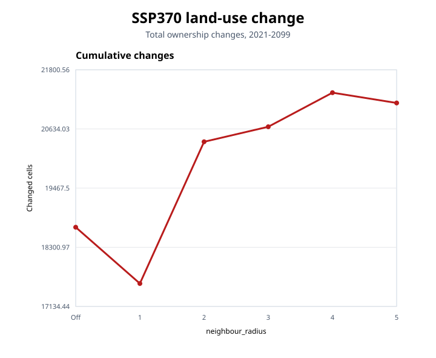
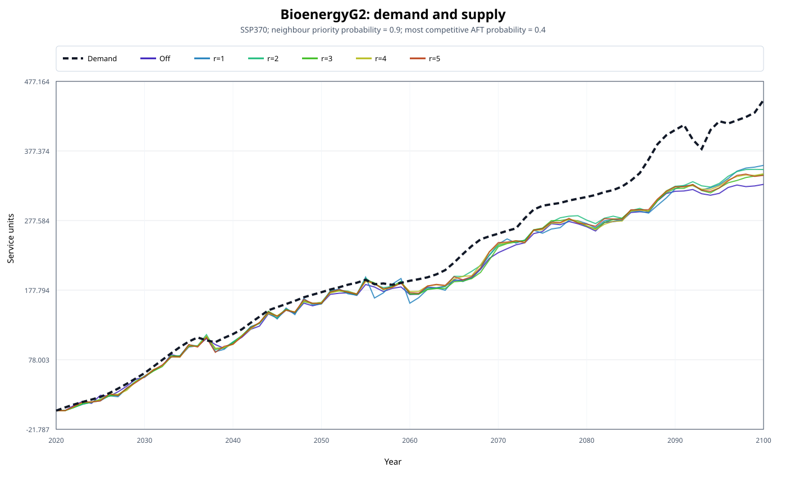
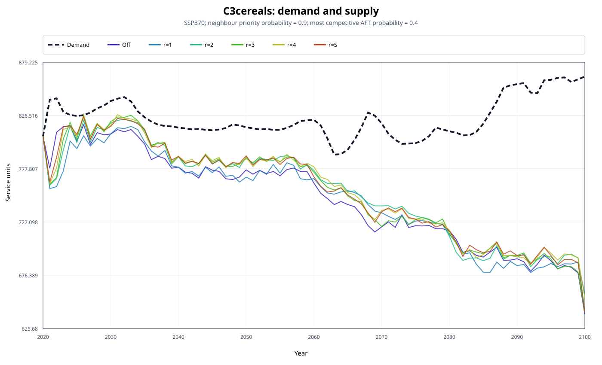
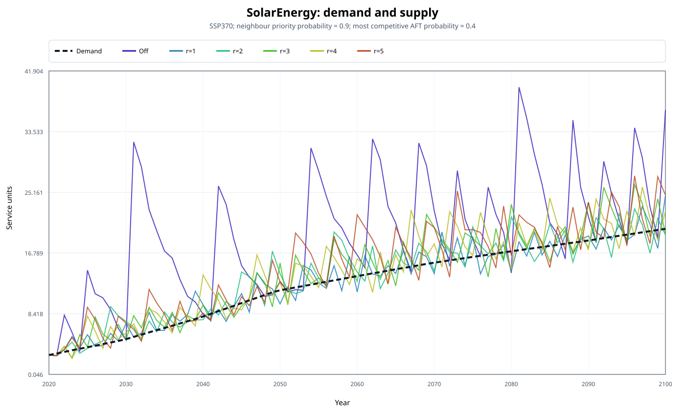

# `neighbour_radius` sensitivities

## Purpose

`neighbour_radius` sets the spatial extent used to identify nearby AFTs when neighbour priority is applied.
CRAFTY uses a Moore neighbourhood: radius 1 includes the eight immediately surrounding cells, while larger
radii extend the square neighbourhood in every direction. For an interior cell, radii 1 to 5 can therefore
inspect up to 8, 24, 48, 80, and 120 neighbouring cells, respectively.

This sensitivity analysis compares radii 1 to 5 under SSP370. The settings selected by the preceding
sensitivity analyses are held constant:

- `use_neighbour_priority: true`;
- `neighbour_priority_probability: 0.9`;
- `marginal_utility_calculations_per_tick: 7`;
- `most_competitive_aft_probability: 0.4`;
- `random_seed: 1`.

The `Off` case is the `neighbour_priority_probability: 0.0`. It is
equivalent to disabling neighbour priority and provides context, but it is not a radius of zero. Comparisons
among radii 1 to 5 isolate the radius effect.

The analysis covers 20 services and the period 2021-2100. The calibrated year 2020 is excluded from the
demand-supply performance summary.

## Measuring performance

Demand-supply convergence uses a model-aligned relative gap:

- for services that penalize oversupply: `abs(supply - demand) / abs(demand)`;
- for services that allow oversupply: `max(demand - supply, 0) / abs(demand)`.

Lower mean gap and RMSE indicate better convergence. The attainment rate is the share of service-years with a
model-aligned gap no greater than 5%. Landscape structure is measured with eight-neighbour Moore fragmentation
metrics.

## Overall result

The response to radius is non-monotonic. Among the tested radii:

- radius 2 has the lowest mean relative gap (7.31%) and gap RMSE (12.18%);
- radius 3 has the highest 5%-attainment rate (57.25%);
- radius 1 creates the most spatially clustered landscape.

Radius 2 is therefore the best overall compromise between aggregate demand-supply convergence and landscape
connectivity. Radius 3 raises attainment by 0.87 percentage points relative to radius 2, but also raises mean
gap and RMSE. At radius 5, RMSE increases to 13.48%, indicating that broadening the neighbourhood further does
not improve aggregate convergence.

| Radius case | Mean gap | Gap RMSE | Within 5% | Land-use changes | Clustering index, 2100 | Patch density, 2100 | Effective mesh, 2100 |
|:---|---:|---:|---:|---:|---:|---:|---:|
| Off | 10.92% | 28.59% | 51.44% | 18,696 | 0.3222 | 0.2826 | 0.0139 |
| 1 | 7.80% | 12.55% | 52.31% | 17,586 | 0.4377 | 0.1574 | 0.0150 |
| 2 | 7.31% | 12.18% | 56.38% | 20,381 | 0.3750 | 0.2075 | 0.0154 |
| 3 | 7.54% | 12.43% | 57.25% | 20,677 | 0.3453 | 0.2410 | 0.0153 |
| 4 | 7.51% | 12.46% | 56.25% | 21,349 | 0.3324 | 0.2568 | 0.0149 |
| 5 | 7.75% | 13.48% | 57.00% | 21,146 | 0.3295 | 0.2646 | 0.0139 |

## Landscape fragmentation

Radius 1 produces the strongest local reinforcement. Relative to the Off control in 2100, its adjacency
clustering index is 35.8% higher and its patch density is 44.3% lower. As radius increases from 1 to 5,
clustering falls from 0.4377 to 0.3295 and patch density rises from 0.1574 to 0.2646.

This direction is expected from the candidate-selection mechanism. A small radius only recognizes AFTs in the
immediate surroundings, reinforcing highly local patterns. A wider radius allows an AFT located farther away to
enter the local candidate set, so the priority rule becomes less spatially restrictive. The normalized
effective mesh size is not monotonic and reaches its highest tested value at radius 2.

## Land-use turnover

Radius 1 has the lowest turnover, with 17,586 changes during 2021-2099. Turnover rises to 20,381 at radius 2 and
reaches 21,349 at radius 4. A broader neighbourhood exposes competition to more locally eligible AFTs, which is
consistent with the greater turnover, although the exact response also depends on service gaps and AFT
competitiveness.

## Selected services

Each figure shows the fixed demand trajectory and an exact line-colour key for the Off control and radii 1 to 5.

### Bioenergy generation 2

BioenergyG2 changes relatively little across the tested radii. Mean gap ranges from 11.67% at radius 5 to
12.77% at radius 1; radius 2 gives 11.78%. This stability shows that the aggregate radius response is not driven
uniformly by every service.

### C3 cereals

C3-cereal convergence improves when moving from radius 1 to the broader neighbourhoods. Mean gap is 9.28% at
radius 1, 8.41% at radius 2, and reaches its lowest value of 8.27% at radius 4. The number of years within 5% of
demand increases from 28 at radius 1 to 39 at radius 4.

### Solar energy

Solar energy favours the smallest active neighbourhood. Its mean gap is 12.14% at radius 1, then rises to
15.50% at radius 2 and 25.52% at radius 5. All active-radius cases remain substantially better than the Off
control (72.77%), but this service illustrates why a larger radius is not automatically more effective.

## Recommendation

Use `neighbour_radius: 2` as the default compromise for the tested SSP370 configuration. It gives the best
aggregate mean gap and RMSE, retains more spatial clustering than radii 3 to 5, and avoids the service-level
deterioration seen at radius 5. Radius 1 is a defensible alternative when compact spatial patterns are more
important, while radius 3 is preferable when maximizing the number of service-years within 5% of demand is the
primary objective.

These results are based on one run per radius with a fixed random seed.
